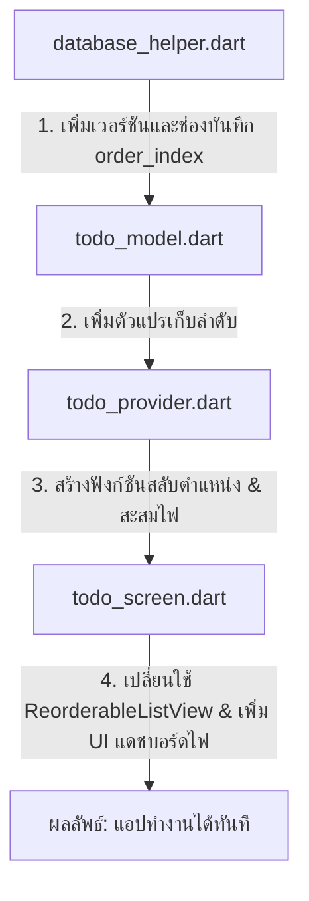

# แผนพัฒนาฟีเจอร์สำหรับ To-Do List (Drag & Drop Reordering & Flame Achievement)

แผนงานนี้จัดทำขึ้นเพื่อแสดงแนวทางออกแบบและการแก้ไขโค้ดสำหรับระบบการเรียงลำดับความสำคัญของงาน (Drag & Drop) และระบบสะสมพลังงานความสำเร็จ (🔥 Flame Achievement)

---

## 🌟 ฟีเจอร์ที่เสนอปรับปรุง

### 1. ระบบลากสลับตำแหน่งสิ่งที่จะทำ (Drag & Drop Reordering)
* **กลไกการทำงาน**: 
  - แทนที่รายการแบบปกติด้วย `ReorderableListView.builder` ของ Flutter
  - ผู้ใช้งานสามารถกดค้างที่รูปไอคอนสำหรับลาก (เช่น `Icon(Icons.drag_handle)`) หรือกดค้างที่แถบรายการเพื่อเลื่อนสลับตำแหน่งขึ้น-ลงได้อย่างอิสระ
* **การบันทึกข้อมูล (Database & State)**:
  - **อัปเกรดตารางฐานข้อมูล**: ปรับโครงสร้างเวอร์ชันของ SQLite เป็นเวอร์ชัน 2 และใช้คำสั่ง `ALTER TABLE todos ADD COLUMN order_index INTEGER DEFAULT 0` ผ่านทาง `onUpgrade` เพื่อความปลอดภัยของข้อมูลเดิม
  - เมื่อผู้ใช้งานปล่อยนิ้ว (Drop) ตัวแอปจะสลับข้อมูลลำดับในหน่วยความจำชั่วคราว (Riverpod state) และเขียนคำสั่งลูปอัปเดตค่าคอลัมน์ `order_index` ลงในฐานข้อมูลของเครื่องโดยอัตโนมัติ

---

### 2. ระบบไฟแห่งความสำเร็จ (🔥 Streak & Flame Achievement)
* **การสะสมคะแนนความสำเร็จ**:
  - ทุกครั้งที่ผู้ใช้กดยืนยันการทำ To-Do ชิ้นนั้นสำเร็จ (ทำเครื่องหมายติ๊กถูก) คะแนนไฟแห่งความตั้งใจ (Flame Score) จะสะสมเพิ่มขึ้นทีละ +1 แต้ม
  - คะแนนนี้จะถูกเก็บถาวรไว้ในฐานข้อมูลคีย์-แวลูส่วนกลางของตัวแอป
* **แถบแดชบอร์ดความพยายาม (Flame Score Dashboard)**:
  - ออกแบบแถบการแสดงผลแบบ Glassmorphism ด้านบนของหน้า To-Do แสดงไอคอนไฟเคลื่อนไหวสีส้มสะดุดตาพร้อมคะแนนสะสมปัจจุบัน เช่น `ความเพียรสะสม: 12 🔥`
* **ข้อความแสดงความยินดี (Congratulation Banner / Feedback)**:
  - ทันทีที่ผู้ใช้คลิกเสร็จงาน จะมีการแสดงผล **Snackbar ดีไซน์พิเศษ** สีเขียวเอฟเฟกต์ Glassmorphism ด้านล่างจอ พร้อมข้อความสุ่มสร้างแรงบันดาลใจแบบไดนามิก เช่น:
    - *"ยอดเยี่ยมมาก! คุณทำภารกิจสำเร็จแล้ว! 🎉 (+1 🔥)"*
    - *"สุดยอดไปเลย! หนทางแห่งความสำเร็จอยู่ไม่ไกล! 🚀 (+1 🔥)"*
    - *"ก้าวหน้าไปอีกขั้นแล้ว! ทำงานนี้สำเร็จได้อย่างงดงาม! ✨ (+1 🔥)"*

---

## 🛠️ แผนการแก้ไขโค้ดรายไฟล์ (Proposed Code Changes)

### [MODIFY] [database_helper.dart](file:///c:/Users/S/OneDrive/Documents/demo-app/lib/core/database/database_helper.dart)
1. ปรับเปลี่ยนเวอร์ชันฐานข้อมูล `version: 2`
2. เพิ่มเงื่อนไข `onUpgrade` เพื่อทำการสร้างคอลัมน์ `order_index` ในกรณีที่อัปเกรดฐานข้อมูล
3. เพิ่มฟังก์ชันอัปเดตตำแหน่ง `updateTodoOrder(int id, int orderIndex)`
4. เพิ่มฟังก์ชันบันทึกและดึงค่าสถิติสะสมไฟ (`getFlameScore` และ `incrementFlameScore`)

### [MODIFY] [todo_model.dart](file:///c:/Users/S/OneDrive/Documents/demo-app/lib/features/todo/todo_model.dart)
1. เพิ่มฟิลด์ `orderIndex` (int) ในคลาสโมเดล
2. ปรับการทำงานของฟังก์ชัน `toMap` และ `fromMap` เพื่อให้รองรับ `order_index`

### [MODIFY] [todo_provider.dart](file:///c:/Users/S/OneDrive/Documents/demo-app/lib/features/todo/todo_provider.dart)
1. เพิ่มตัวแปร `flameScore` (int) ในสถานะ `TodoState`
2. ปรับเปลี่ยนลำดับการแสดงผลคิวรีข้อมูล (Query) ให้ทำการเรียงลำดับตาม `order_index ASC` ก่อน
3. พัฒนาฟังก์ชัน `reorderTodos(int oldIndex, int newIndex)` สำหรับจัดการขยับตำแหน่งและอัปเดตลงฐานข้อมูล
4. ปรับฟังก์ชัน `toggleTodo` ให้เรียกคำสั่งบวกแต้มคะแนนไฟเมื่อติ๊กถูก และลดแต้มไฟหากผู้ใช้กดยกเลิกการทำเสร็จ (ป้องกันการปั๊มคะแนน)

### [MODIFY] [todo_screen.dart](file:///c:/Users/S/OneDrive/Documents/demo-app/lib/features/todo/todo_screen.dart)
1. เพิ่ม UI แสดงการ์ดสะสมความสำเร็จไฟ (🔥 Flame Badge Card) ที่เป็นกระจกฝ้าใส (Glassmorphism)
2. เปลี่ยน `ListView.builder` เป็น `ReorderableListView.builder`
3. เพิ่มตัวดึงข้อมูลลากสลับตำแหน่ง `ReorderableDragStartListener` เข้าไปในแต่ละการ์ดงาน
4. ใส่ Logic แสดงผลข้อความยินดี (SnackBar) สุ่มข้อความโดยอัตโนมัติเมื่อกดติ๊กถูกสำเร็จภารกิจ

---

## 🧪 แผนการทดสอบระบบ (Verification Plan)

### 1. ทดสอบการลากสลับตำแหน่ง (Drag & Drop)
* ทดสอบเพิ่มรายการสิ่งที่ต้องทำ 3 รายการ
* ทำการกดค้างที่แถบรายการตัวล่างสุด ลากขึ้นไปไว้ด้านบนสุด แล้วตรวจสอบว่าตำแหน่งสลับตามนิ้วมือหรือไม่
* ทำการปิดแอปพลิเคชันและเปิดใหม่อีกครั้ง เพื่อตรวจสอบว่าข้อมูลลำดับที่ลากสลับไว้ยังเรียงอยู่ตำแหน่งเดิม (การบันทึก SQLite ทำงานได้สมบูรณ์)

### 2. ทดสอบระบบความสำเร็จไฟ (🔥 Flame & SnackBar)
* ตรวจสอบว่าแต้มไฟเริ่มต้นเท่ากับ `0 🔥`
* กดทำเครื่องหมายเสร็จสิ้นงาน 1 ชิ้น:
  - สังเกตว่าตัวเลขไฟเปลี่ยนเพิ่มขึ้นเป็น `1 🔥`
  - สังเกตการแสดงผลของแถบข้อความยินดี (SnackBar) ว่ามีคำชื่นชมและสัญลักษณ์งานสำเร็จแสดงผลหรือไม่
* ทดสอบกดยกเลิกติ๊กถูก เพื่อตรวจสอบว่าแต้มไฟลดกลับมาจุดเดิมและไม่มีข้อความใดๆ รบกวน
